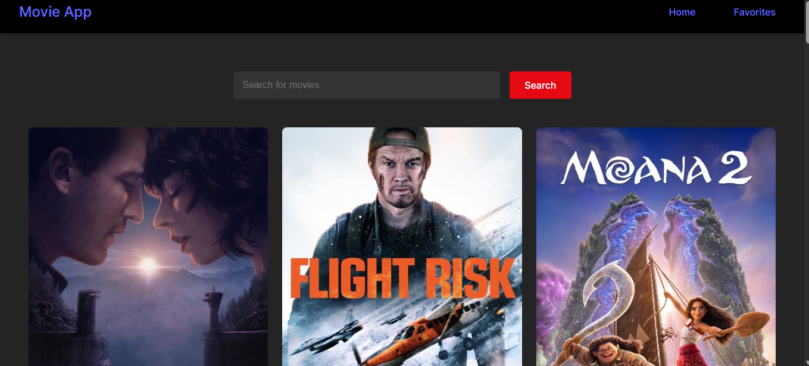

# Movie Store

Movie Store is a React-based web application that allows users to browse and favorite movies. It fetches movie data from an API and provides an interactive user experience.

## 🚀 Features

- Browse popular movies
- Add/remove movies from favorites
- Persist favorites using local storage
- Responsive design

## ⚙️ Installation & Setup

### 1️⃣ Clone the Repository

```sh
git clone https://github.com/ZekariyasT/Movie-store.git
cd movie-store/frontend
```

### 2️⃣ Install Dependencies

```sh
npm install
```



